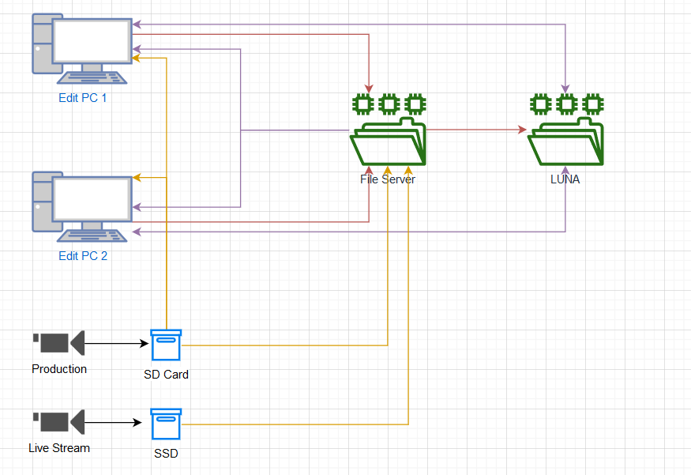

# What is this project?
We are looking at creating a file server to edit off. This will hopefully remove the load of having drives that fill up in the edit PC's. Additionally, it will allow other people to use the Edit PC's whilst something is being uploaded to LUNA. This problem (drives being full) has caused many problems over recent times. The end goal is:
- Edit PC drives stay empty ish
- Scratch disks will stay on Edit PC's
- Projects can be worked on from any machine
- Eventually have a dedicated render machine
- Auto backup to LUNA
- An ingest station that SD cards / SSDs are put in to auto copy / label footage

# Quick note
I would recommend looking over the [Jargon](./Jargon.md) file if you need help understanding some terminology.

# Things to cover
 - [x] [Operating System](./Operating-System.md)
 - [x] [RAID](./RAID.md)
 - [x] [System Specs](./System-Specs.md)
 - [ ] Login System
 - [ ] Auto Ingest

# Diagram
This is a quick diagram of what I hope to achieve with this

