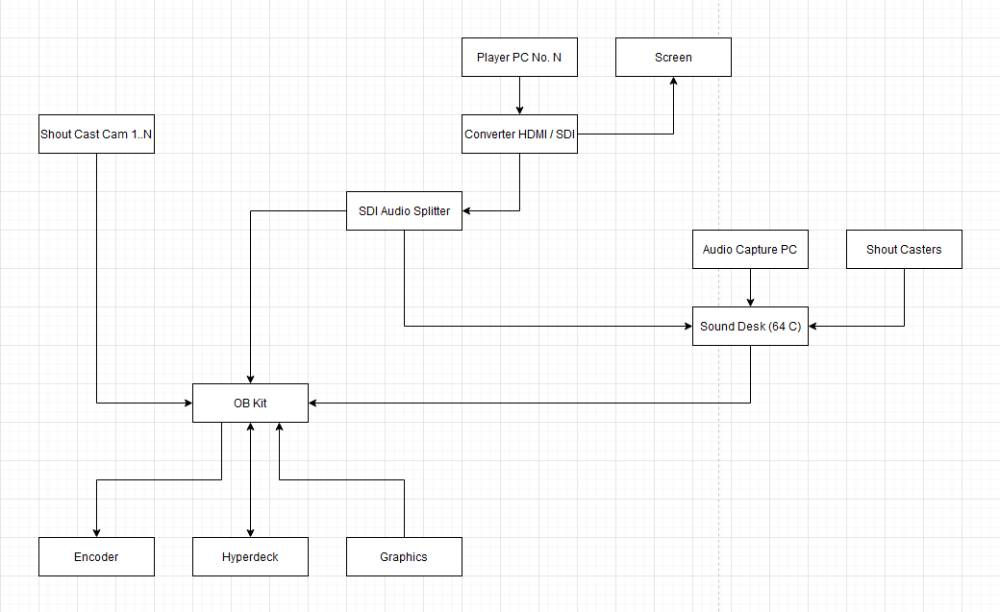

# Idea brief
This idea involves my first thoughts and cable diagrams as to how we could wire it up to capture all the videos and do live playback.

# Cable Plan

## Diagram Description
In this diagram there are many different things that we have to consider. I will break these things down in this section.

### Player screen / gameplay capture
To capture the screen of the players we could use a HDMI to SDI converter with passthrough from the HDMI output going to the screen. The major issue with this is introducing delay to the screen which during competetive matches is not optimal as every milisecond counts during these games. Additionally not all modern GPUs support HDMI as many are shifting over to display port for output.

An alternative would be to use a second HDMI output from the graphics card which just goes to the converter. However this would increase system resource usage as we would be having to redraw each screen twice. This can also introduce lag or even other issues. 

To capture the audio we will disembed it using an SDI to Quarter inch converter. This can then patch the game audio into the sound desk with Quarter inch to xlr converters.

### Team chat capture
To capture the voice chat that the teams are using we can use a dedicated PC or 2 that output any audio from discord / teamspeak / etc to the sound desk. Depending on how the game voice chat is being done this may not be needed.

### Shout Casters
Shout caster audio can be captured in many ways.

If the shout casters aren't at the location, we can capture their audio from discord or through a livestream that they could provide us (this is unlikely though).

More than likely they will be at location. As such we could use shotgun mics or wireless lavs (would look nicer and provide cleaner audio).

### Shout caster cameras
We can hook up any shout cast cameras as we normally would with any other camera.

### Live playback
To do live playback we could use a hyperdeck that plays back the video that it recorded. This would require another media engine just to decide what is being played back. Adding more hyperdecks for live replay would require more media engines.